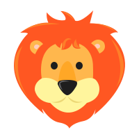
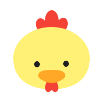
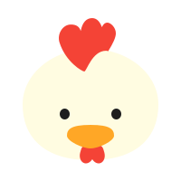
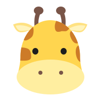
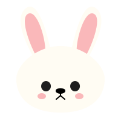
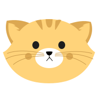
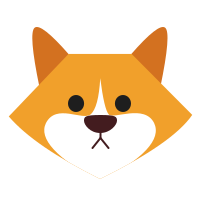
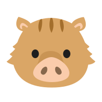

# [Animal Shogi](http://zer0rei.github.io/animal-shogi)

[Animal Shogi](http://zer0rei.github.io/animal-shogi) is a mini competitive board game based on shogi (Japanese chess).

## Illustrations

#### Lion

#### Chick

#### Hen

#### Elephant

#### Giraffe

#### Rabbit

#### Cat

#### Dog

#### Boar

## Licence

